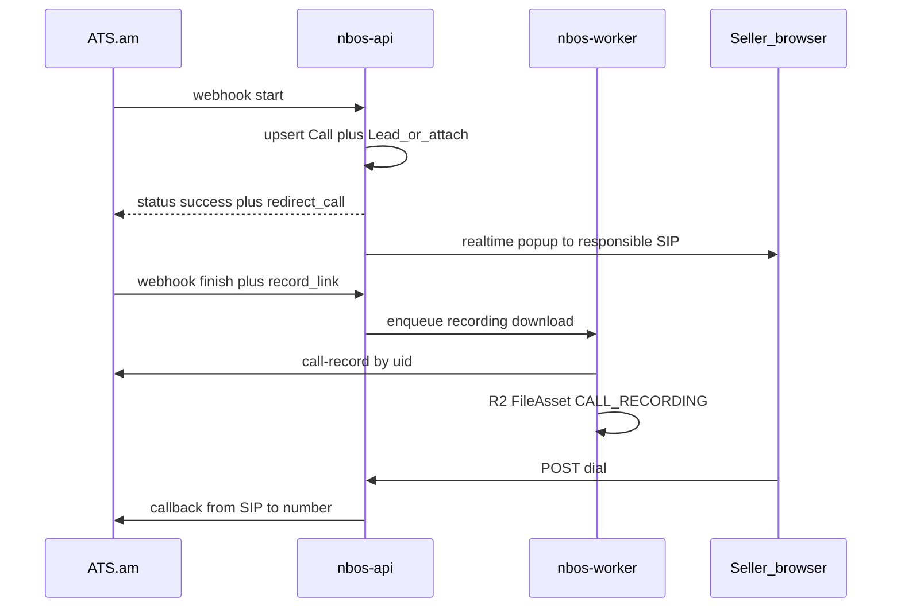

# ATS.am: канон, затем телефония от и до

Порядок как в [каноне работы с модулями](docs/NBOS/00-Module-Documentation-Working-Method.md): сначала согласованная логика в `docs/NBOS`, потом код. Бизнес-правила из чата считаем принятыми (нет возражения owner).

ATS уже отдаёт ровно четыре вещи ([документация ATS.am](https://ats.am/ru/apidocumentacia)): webhook активных звонков, `callback`, `history`, `call-record`. Транскрипта нет — в этот срез не входит.

---

## Что уже есть (не ломать)

- Webhook [`POST /api/integrations/ats/webhook`](apps/api/src/modules/integrations/ats/ats.controller.ts): ключ, inbound Lead, дедуп, `redirect_call` по `Employee.sipId`.
- Канон MVP: [`docs/NBOS/06-Integrations/09-ATS-AM-Integration.md`](docs/NBOS/06-Integrations/09-ATS-AM-Integration.md).
- Intake attach: [`07-Lead-and-Deal-Merge.md`](docs/NBOS/02-Modules/01-CRM/07-Lead-and-Deal-Merge.md) — новый Contact на звонке **не** создаём.
- CRM уже разделяет History (аудит) и Calls (телефония): Deal имеет пустой [`DealCallsTab.tsx`](apps/web/src/features/crm/components/DealCallsTab.tsx); Lead History — тоже заглушка, **вкладки Calls нет**; Contact — заглушка Communication («Messenger, calls, notes»).
- Drive: `CALL_RECORDING` + `FileLink` есть; пути создания — presign (человек) или `createGeneratedFileAsset` (сервер уже имеет байты). **Джобы «скачать URL ATS → R2» нет.** У CONTACT storage-home `clients/contact-…/recordings/`; у LEAD отдельного пути нет (сейчас `misc/lead/…`).
- `Employee.sipId` в HR / My Account → General → Contacts («ATS SIP ID»).
- Realtime уже два контура, оба **нельзя** просто переиспользовать для окна звонка:
  - Messenger Socket.io (`/messenger`, комната `messenger:user:{employeeId}`) живёт только на странице Messenger и требует MESSENGER VIEW — продавец на CRM окно не увидит.
  - Notification SSE в Topbar всегда включён, но контракт только badge/list (`unreadCount`), без тела, без toast.

Ключ на worker/scheduler для webhook не нужен. Callback/history/record зовёт **API или worker** — ключ там.

---

## Часть A — документация (делать первой, одним связным пакетом)

Не плодить пятый «черновик». Один продуктовый канон + расширенный контракт провайдера + точечные правки якорей.

### Новый канон продукта

Создать [`docs/NBOS/02-Modules/01-CRM/08-Calls-and-Telephony.md`](docs/NBOS/02-Modules/01-CRM/08-Calls-and-Telephony.md):

- Зачем: заменить Bitrix-телефонию, не хуже по карточке звонка, лучше по контексту Deal/Project/Product в одном окне.
- Сущность **Call** (не новая воронка): один `uid` ATS = одна запись. Видна на Lead и на Contact (если Contact уже есть). Deal / Project / Product — контекст, не второе хранилище звонка.
- Правила сущностей (как согласовали):
  - новый номер → Lead, Contact нет;
  - открытый Lead с тем же телефоном → привязать, не плодить;
  - Contact + открытый Deal → новый Lead нет, звонок на исходный Lead сделки;
  - исходящий на новый номер → Lead в момент звонка.
- Ответственный и окно:
  - inbound + известный SIP → `redirect_call`, окно **только** этому сотруднику;
  - inbound без SIP (новый / пустой `sipId`) → окно не всем; после `state=status` окно тому, чей SIP = `op`;
  - outbound → окно инициатору сразу.
- Состав полноэкранного окна: направление, номер, имя; Contact; открытый Deal (стадия, сумма); Project / Product если есть; последние звонки; после finish — длительность, статус, плеер, заметка.
- История звонков **отдельно от History-аудита**: вкладка Calls на Lead и Deal; на Contact — секция в Communication (или вкладка Calls, если зеркалим CRM). Delivery Card Calls — позже та же лента, не свой таймлайн.
- Запись: один `FileAsset` (`CALL_RECORDING`, `sourceModule: 'ats'`) + два `FileLink` (`LEAD`, `CONTACT` если есть). Не вечная `record_link`. Files tab Contact недостаточен (нет duration/disposition/uid) — нужен list API Call.
- Права: как CRM — Seller свои/назначенные, Head of Sales / CEO / Owner все; записи `CONFIDENTIAL`.
- Явно later: транскрипт, DID → MarketingAccount, импорт истории Bitrix, broadcast всем селлерам.

### Расширить контракт ATS

Переписать [`09-ATS-AM-Integration.md`](docs/NBOS/06-Integrations/09-ATS-AM-Integration.md) из «MVP only» в полный контракт:

- webhook поля + **голый** JSON `{ status, redirect_call }` (без `{ data }`);
- `GET callback?key&from&to`;
- `GET history`;
- `GET call-record?uid`;
- IP allowlist ATS (их требование);
- ключ только в env API (и worker для download/callback);
- out of scope этого файла: UI (ссылка на `08-Calls-and-Telephony.md`).

### Дописать якоря (коротко, без дублей)

- [`03-Core-Entities-and-Data-Model.md`](docs/NBOS/01-Platform-Overview/03-Core-Entities-and-Data-Model.md) — Call как спутник Lead/Contact.
- [`00-Technical-Decisions-By-Module.md`](docs/NBOS/00-Technical-Decisions-By-Module.md) — CRM: Call = выросший `AtsCallEvent`; popup = **отдельный** app-shell realtime на сотрудника (клон notification SSE + Redis), не `/messenger` и не `notifications.unread.changed`; запись = worker → R2.
- [`00-Documentation-Hub.md`](docs/NBOS/00-Documentation-Hub.md) — ссылка на новый канон.
- [`04-External-Services.md`](docs/NBOS/06-Integrations/04-External-Services.md) — Фаза 2 из «позже» в этот срез.
- [`02-CRM-Pages.md`](docs/NBOS/05-UI-Specifications/02-CRM-Pages.md): Lead + Deal вкладка Calls ≠ History. Contacts / Client Portfolio: Communication включает ленту звонков. Delivery Card Calls — проекция, не отдельное хранилище ([`DeliveryItemDetailCallsPanel.tsx`](apps/web/src/features/projects/components/delivery-board/DeliveryItemDetailCallsPanel.tsx) уже говорит об этом).
- Новый короткий UI-канон окна: `docs/NBOS/05-UI-Specifications/11-Call-Screen.md` (fullscreen overlay, не sheet).
- [`06-Implementation-Status.md`](docs/NBOS/02-Modules/01-CRM/06-Implementation-Status.md) + cleanup register: ссылка на 08.
- [`IMPLEMENTATION_PROGRESS.md`](docs/IMPLEMENTATION_PROGRESS.md): телефония больше не «нет подканона / 2C blocked» — канон есть, креды есть.
- После появления cron: строка в [`05-Scheduler-Catalog.md`](docs/NBOS/02-Modules/16-Settings-Admin/05-Scheduler-Catalog.md).

Ops в каноне (не код): Cloudflare skip Bot Fight на `POST /api/integrations/ats/webhook`; в кабинете ATS URL с тем же ключом; у ответственных заполнен SIP; ATS знают IP наших исходящих (callback/history/record).

---

## Часть B — реализация (только после канона)

Каждый этап: схема/API/web по необходимости → тесты → `verify-before-completion` по затронутому контуру. Не включать транскрипт и DID.

### Этап 1 — стабильный webhook (без UI)

Иначе окно и `redirect_call` бесполезны.

- `@SkipTransform()` + `@SkipThrottle()` на [`ats.controller.ts`](apps/api/src/modules/integrations/ats/ats.controller.ts).
- Тест: ответ ровно `{ status: 'success' }` / с `redirect_call`.
- Канон уже описал Cloudflare/IP — в коде не эмулировать.

### Этап 2 — модель Call (expand-only миграция)

Растить [`AtsCallEvent`](packages/database/prisma/schema/integrations.prisma), не плодить вторую таблицу:

- `contactId`, `dealId?`, `projectId?`, `productId?`
- `responsibleEmployeeId?` (кому redirect / кто инициировал)
- `answeredEmployeeId?` (SIP из `op` на answer)
- `note?`, `rate?`, `recordingFileAssetId?`
- индексы `leadId`, `contactId`, `clid`, `createdAt`

Риск миграции: LOW (nullable columns + indexes). По [`safe-database-migration`](.agents/skills/safe-database-migration/SKILL.md): только expand, без drop. Прод-миграцию не гонять без явной просьбы.

Ингест: резолв контекста (Contact → Deal → Project/Product) в том же пайплайне, что Lead. Исходящий `calldirect=1` на новый номер → Lead (сейчас исходящие Lead не создают — это смена поведения, в каноне уже будет).

### Этап 3 — realtime окно ответственному

Решение по коду (не вешать на существующие каналы):

- **Не** новое событие на [`MessengerGateway`](apps/api/src/modules/messenger/messenger.gateway.ts): сокет не в app shell.
- **Не** расширять `notifications.unread.changed`: там нет тела, только silent refetch.
- **Да:** отдельный employee-канал по образцу [`notification-sse.hub.ts`](apps/api/src/modules/realtime/notification-sse.hub.ts) + Redis pub/sub (мульти-реплика) + BFF EventSource как у уведомлений. Слушатель в layout/Topbar, не на `/messenger`.
- Точка emit: после резолва сотрудника в redirect/`op` (сейчас [`AtsCallRedirectService`](apps/api/src/modules/integrations/ats/ats-call-redirect.service.ts) отдаёт только SIP-строку — нужно сохранить `employeeId`).
- События: `call.started`, `call.answered`, `call.finished` + snapshot контекста.
- Web: fullscreen overlay только текущему `employeeId`.
- Новый номер без SIP: окно после answer. Известный: окно на `start` после redirect.
- Новый `/calls` Socket.IO namespace не открывать в этом срезе (лишний handshake); если понадобится интерактивный ack — отдельное решение.

### Этап 4 — история в карточках

- Новый list API `AtsCallEvent` (не Drive files): фильтр `leadId` | `contactId` | `dealId`.
- Lead: новая вкладка `calls` в [`LEAD_SHEET_TABS`](apps/web/src/features/crm/components/LeadSheetLoadedContent.tsx) рядом с History; History оставить под аудит.
- Deal: наполнить существующий [`DealCallsTab.tsx`](apps/web/src/features/crm/components/DealCallsTab.tsx) тем же списком (не мешать с `DealHistoryTab`).
- Contact: лента внутри Communication в [`ClientPortfolioTabPanels.tsx`](apps/web/src/features/clients/components/client-portfolio/ClientPortfolioTabPanels.tsx); Files остаётся Drive.
- Один empty-state/layout на три поверхности.
- Кнопка «Позвонить» на Lead/Contact/Deal — живая сразу, если этап 6 идёт следом.

### Этап 5 — записи

На `finish`/`end`, когда есть `record_link` / uid:

- Новая BullMQ job: скачать `call-record` (fallback `record_link`) → байты в API → `DriveService.createGeneratedFileAsset` (`purpose: CALL_RECORDING`, `sourceModule: 'ats'`, `AUDIO`).
- Не хранить только `EXTERNAL_URL` (ссылка ATS может протухнуть).
- Два `FileLink`: `LEAD` + `CONTACT` (если `contactId` есть). Исходящий без Lead — линк на Contact по телефону, когда появится.
- Добавить LEAD storage-home (`…/recordings/`), иначе файлы уйдут в `misc/lead/…`.
- `recordingFileAssetId` на Call, чтобы UI не искал запись только через links.
- Плеер в Calls-ленте и в окне после finish; заметка `PATCH note`.
- `ATS_API_KEY` на **worker**.

### Этап 6 — исходящий click-to-call

- `POST` внутреннего API (не публичный ATS URL из браузера): сервер зовёт `https://account.ats.am/docs/api/v1/callback`.
- `from` = SIP текущего employee, `to` = номер.
- Сразу создать/найти Call + открыть то же окно инициатору.
- Пустой `sipId` у звонящего → 4xx, не тихий fail.

### Этап 7 — сверка history (устойчивость)

- Scheduler job + строка каталога: добрать звонки, которых нет по `uid`; докачать записи.
- Не создаёт дубли Lead (те же правила attach).
- Вкл через Settings → Scheduler, не вечный fire на API.

### Этап 8 — полировка и приёмка

- Settings Integrations: карточка ATS больше не «Applicant tracking coming soon» — статус ATS.am (ключ настроен / нет), без секрета.
- Delivery Card Calls: та же лента по Contact/Lead после даты карточки (канон Delivery).
- Security-review на webhook, SSE, записи, callback.
- Ручной чеклист: новый номер → Lead + окно после ответа; известный Contact → redirect + окно продавцу; исходящий; запись на Lead и Contact; повтор `uid` без второго Lead.

---

## Явно не в этом срезе

- Речь → текст / AI «что говорили».
- Call tracking по DID / MarketingAccount.
- Импорт старых звонков из Bitrix.
- Popup всем селлерам.
- Менять канон «Contact не создаём на звонке».

---

## Критерий готово

Входящий и исходящий звонок дают одну запись Call, историю на нужных карточках, запись в Drive, и полноэкранное окно только у ответственного с Contact / Deal / Project / Product если они есть. Webhook отвечает контракту ATS. Планировщик по-прежнему не участвует в приёме звонка, кроме опциональной сверки history.
